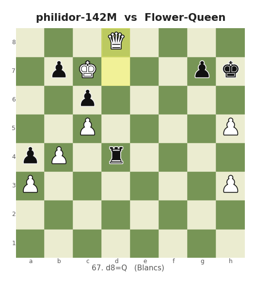

# Philidor

**English** · [Français](#philidor-fr)

A language model trained from scratch that plays chess **without ever being told the rules**.

It never sees a board. It receives a sequence of moves in UCI notation, `e2e4 e7e5 g1f3`, and its only task is to predict the next one. Everything it "knows" about the game, it inferred from 800 million moves played by humans.

```
97.86 %   of the moves it proposes are legal, in free generation, with no constraint
51 M      parameters, trained in 2 hours on a single RTX 3090
1719      Lichess rapid rating, against real players
98/100    wins against a generalist model 681 times larger
```

**[Read the full article](https://www.billygirboux.fr/fr/blog/modele-ia-echecs-weekend)** (in French): the story of the project, the choices, the measurements, and the mistakes, including one that nearly cost fifteen hours of compute.

**[Part two: from 1700 to 2000](https://www.billygirboux.fr/fr/blog/philidor-1700-a-2000)** (in French): an intuition, a judge and a search take the bot past 2000 on Lichess. [Everything is below](#from-1700-to-2000-an-intuition-a-judge-and-a-search), in [`juge_recherche/`](juge_recherche/).

> Code comments are in French. The English README below covers everything you need to reproduce the experiment.

---

## One game, all the way to checkmate

The endgame of a rated rapid game on Lichess, won against an opponent rated 1965, that is 241 points above. The model plays White. It pushes a pawn to promotion and mates with two queens, on move 86.



Not a single illegal move across the 171 half-moves of the game, and an endgame played to the finish by a model that never sees the board and decides in a few milliseconds, without searching a single variation.

Full replayable game: [lichess.org/delDiQ5h](https://lichess.org/delDiQ5h)

---

## What this repository contains

Everything needed to redo the experiment end to end: build the vocabulary, filter a Lichess dump, train the model, evaluate it, pit it against Stockfish, and put it online as a bot. Then the second step: a judge and a search that take it from 1700 to 2000 ([below](#from-1700-to-2000-an-intuition-a-judge-and-a-search)).

No exotic dependencies. Plain PyTorch, no training framework: every line of the loop is readable.

## The trained models

| Model | Parameters | Data | Duration | Legal moves |
|---|---|---|---|---|
| [philidor-51m](https://huggingface.co/billygeekourson/philidor-51m) | 51 M | 800 M tokens | 2 h | 97.86 % |
| [philidor-142m](https://huggingface.co/billygeekourson/philidor-142m) | 142 M | 3.2 G tokens | 18 h | 98.85 % |

The second one plays online: [lichess.org/@/philidor-142M](https://lichess.org/@/philidor-142M). Feel free to challenge it.

## Try the model in three lines

```python
from transformers import AutoModelForCausalLM, AutoTokenizer

tok = AutoTokenizer.from_pretrained("billygeekourson/philidor-51m")
model = AutoModelForCausalLM.from_pretrained("billygeekourson/philidor-51m")
print(tok.decode(model.generate(**tok("e2e4 e7e5", return_tensors="pt"))[0]))
```

The model loads as a standard `LlamaForCausalLM`: RMSNorm, RoPE, SwiGLU and pre-norm *are* the Llama architecture.

---

## Installation

```bash
git clone https://github.com/geekourson/philidor.git && cd philidor
python3 -m venv venv && source venv/bin/activate

pip install torch --index-url https://download.pytorch.org/whl/cu126
pip install -r requirements.txt
```

Reference hardware: RTX 3090 (24 GB), 32 GB of RAM, 6 cores. Plan for **150 GB of disk space** for one month of Lichess data.

> **First, check that your GPU is not power-capped.** This is the first trap of the project: the reference card was running at 170 W instead of 420, that is 40 % of its power, with nothing to signal it.
> ```bash
> nvidia-smi --query-gpu=name,power.limit,power.default_limit --format=csv
> python bench_gpu.py    # measures the real TFLOPS
> ```

## Reproducing the experiment

### 1. The vocabulary

One move is one token, indivisible. The vocabulary is the finite set of the 1968 geometrically possible UCI moves, plus `<pad>`, `<bos>` and `<eos>`.

It does not depend on any data, only on the rules of the game: `data/vocab.json` is provided as is. To regenerate it identically:

```bash
python vocab.py data/vocab.json          # 1971 tokens
```

### 2. The data

```bash
cd data && wget -c https://database.lichess.org/standard/lichess_db_standard_rated_2026-07.pgn.zst && cd ..

python prepare_data.py benchmark --games 50000            # 2 min, do not skip
python prepare_data.py parse --workers 10 --target-tokens 800e6 \
  --out data/games_uci.txt --stats logs/phase1_parse_stats.json
python prepare_data.py encode --games data/games_uci.txt \
  --vocab data/vocab.json --outdir data
```

Out of 89 million games read, 11 million are kept: both players between 1800 and 2600 Elo, bullet excluded, normal termination, between 20 and 300 half-moves.

The train/validation split is done **per game, never per token**. Cutting the stream at token level puts a single game across both sets, which improves validation loss with no symptom whatsoever.

### 3. The guardrail, before committing hours of compute

```bash
python train.py --overfit --overfit-games 100 --overfit-steps 1200 --batch-size 64
```

The loss must fall below 0.05. Measured: from 7.13 to **0.035 in 270 steps**, that is 2 min 08. If it does not, there is a bug, and the full run will only reproduce it overnight.

### 4. Training

```bash
python train.py --run-name run1 --device cuda:1 \
  --batch-size 192 --max-steps 16300 --warmup-steps 500 --snapshot-every 1000
```

Exactly two hours. 801 M tokens, 120,000 tokens/s, 64 % MFU.

`--snapshot-every` freezes a snapshot every 1000 steps. Without it, there is no way to reconstruct afterwards **in which order** the model learns the rules, which is the most interesting result of the project.

In parallel, on a second card:

```bash
python eval_watcher.py --run-name run1 --device cuda:0 --prefix eval
```

### 5. Evaluating

```bash
python evaluate.py --ckpt checkpoints/run1_best.pt --device cuda:1 \
  --n-legal 20000 --n-agreement 20000 --n-per-rule 500 --n-full-games 500 \
  --out logs/eval_final.json
```

> **Temperature is a parameter of the measurement, not of the model.** Comparing two models evaluated at different temperatures produces an artificial gap. One temperature per metric, fixed in advance: 1.0 for legality (the harshest test), 0 for matches.

### 6. Playing strength

```bash
python elo_match.py --ckpt checkpoints/run1_best.pt --device cuda:1 \
  --stockfish $(which stockfish) --levels 0 1 2 3 --games 200 --movetime-ms 50

python elo_match.py --ckpt checkpoints/run1_best.pt --device cuda:1 \
  --skip-stockfish --ladder --ladder-run run1 --ladder-games 60
```

### 7. Using the model

```bash
python play.py --ckpt checkpoints/run1_best.pt              # play against it
python engine.py --ckpt checkpoints/run1_best.pt --selftest # UCI engine
python convert_to_hf.py --ckpt checkpoints/run1_best.pt --out hf/philidor-51m
```

---

## Results

### What it inferred on its own

**97.86 %** legal moves in free generation, Wilson interval at 95 % from 97.65 to 98.05 %, over 20,000 positions. No mask: the model may propose any of the 1971 tokens in its vocabulary.

### The order in which the rules are learned

| Rule | Nature for a network | 49 M tokens | 786 M tokens |
|---|---|---|---|
| Castling | fixed pattern, 4 constant strings | 98.7 % | 100 % |
| En passant | rare but distinctive pattern | 98.0 % | 100 % |
| Promotion | pattern with a condition attached | 88.0 % | 99.3 % |
| Getting out of check | no pattern, state to reconstruct | 76.7 % | 96.0 % |

Castling and en passant, the two rules explained **last** to a beginner, are acquired immediately. Not staying in check, the most fundamental constraint of the game, is the only one that requires a genuine learning trajectory.

The reason has nothing to do with chess: what is frequent and canonical in the data is learned almost for free, what requires reconstructing a latent state is paid for in data.

### Against Stockfish

| Opponent | Score | Elo gap |
|---|---|---|
| Stockfish level 0 | 56.0 % | +42 ± 45 |
| Stockfish level 1 | 37.8 % | −87 ± 44 |
| Stockfish level 2 | 26.2 % | −180 ± 48 |
| Stockfish level 3 | 18.0 % | −263 ± 52 |

These gaps are **relative** to a capped Stockfish on this machine. Converting them to Lichess Elo would require an anchor point not verified here, so `METRICS.json` carries `"elo_absolu": "non mesuré"`.

### Against a 35-billion-parameter generalist

Same question asked to both, no list of legal moves provided, a single attempt for our model against **30 attempts** granted to the opponent:

| Model | Size | Legal moves | Over 100 games |
|---|---|---|---|
| Philidor | 51 M | 97.86 % | 98 W / 2 D / 0 L |
| Philidor | 142 M | 98.85 % | 99 W / 1 D / 0 L |
| Qwen3.6 | 35 B | 36.18 % | 0 win |

Zero unreadable answers from Qwen: it understands the instruction and always replies in the right format. **It does not get the task wrong, it gets the move wrong.** It never built a board internally.

All raw measurements, with their protocols and confidence intervals, are in [`METRICS.json`](METRICS.json).

---

### Determinism across two GPUs

The engine is deterministic: temperature zero, frozen weights, fixed seeds, imposed
openings. Replaying the same 200-game duel on the other card still moved the result.

`determinisme_gpu.py` measures where that comes from, position by position. It loads the
same checkpoint twice, once per card, masks the logits to the legal moves and compares the
argmax on 500 validation positions the model has never seen. The same run is repeated in
fp32 as a control.

```console
$ python determinisme_gpu.py --ckpt checkpoints/run2_best.pt --n 500 --a cuda:0 --b cuda:1
  cuda:0 : NVIDIA GeForce RTX 3090
  cuda:1 : NVIDIA GeForce RTX 3060

                                    bf16        fp32
positions compared                   500         500
different move between cards     2 (0.40%)    0 (0.00%)
logit gap, median                 6.25e-02    2.86e-06
logit gap, maximum                1.25e-01    1.14e-05
margin 1st/2nd IF disagreement      0.0625        ---
margin 1st/2nd if agreement         1.0625      1.0567
```

bf16 keeps eight bits of mantissa, which at the scale of these logits gives a quantisation
step of **0.0625**, or 1/16. The two disagreements have a first-to-second margin of exactly
**0.0 and 0.0625**, zero or one step of that grid, against a median of 1.0625 when the cards
agree. The cards never make a mistake: they break ties differently between moves the model
rates equal at the precision it computes in. In fp32 the gap falls by a factor of twenty
thousand and the disagreement disappears.

The non-zero fp32 residual (2.86e-06) is the direct evidence that the two cards do not run
the same operations in the same order. bf16 does not create the gap, it amplifies it until
it flips a ranking.

**The rule**: a deterministic engine is not a reproducible engine from one machine to
another. Both arms of an A/B must run on the same card, otherwise the hardware becomes a
hidden variable of the experiment.

`plots_determinisme.py` draws the figure from `results/desaccord_exemple.json`, a real
disagreement case: same position, `Rxf7` on one card, `Ne4+` on the other.

---

## From 1700 to 2000: an intuition, a judge, and a search

**[Read the second article](https://www.billygirboux.fr/fr/blog/philidor-1700-a-2000)** (in French). Everything it describes is in [`juge_recherche/`](juge_recherche/), with the raw outputs in [`results/juge_recherche/`](results/juge_recherche/).

The 142 M model plateaued at 1700. Weeks of attempts to make it imitate better (bigger, more data, Stockfish moves as targets, reasoning tokens, latent loops) brought nothing. A diagnostic showed why: **it plays the most probable move, not the best one**. On 5,000 unseen middlegame positions it blunders 18.3 % of the time (humans: 20.7 % on the same positions), yet when it blunders the best move was among its first five ideas 71.5 % of the time, it "sees" pieces under attack (linear probe, AUC 0.992), and 73 % of its blunders are visible within 4 plies. The problem is the choice, not the knowledge.

So the bot became **two transformers of the same architecture and a search**:

| Part | Role | What it is |
|---|---|---|
| **Policy** | proposes moves (the intuition) | the 142 M model, **unchanged** |
| **Judge** | says who is winning after a move | a copy of the same 142 M transformer, fine-tuned on the Stockfish evaluations that Lichess stores in annotated games (`[%eval]`) |
| **Search** | makes them think ahead | PUCT, as in AlphaZero: the policy chooses where to look, the judge scores the positions reached |

No opening book, no hand-written evaluation. **Stockfish never plays inside the bot**: it is distilled into the judge through the `[%eval]` annotations, and used only to measure.

### What each step is worth

Every duel uses paired openings (each random opening is played twice, colours swapped) and a clone control, with 95 % intervals.

| Step | Offline blunder rate (≥ 100 cp, 5,000 positions) | Duel |
|---|---|---|
| Policy alone (argmax) | 18.32 % | reference |
| Ceiling: Stockfish depth 1 / 4 / 12 choosing in the top-5 | 14.94 / 11.88 / 5.14 % | +126.8 / +329.1 / +599.4 vs policy |
| Judge v1: small head on the frozen trunk (1.5 M candidates) | 15.72 % | **+51.8** [+38.3 ; +65.5] vs policy |
| Judge v2: full copy, 1 month of evaluations (67.8 M) | 15.28 % | **+129.9** [+115.8 ; +144.5] vs policy; +54.3 vs judge v1 |
| Judge v2 retrained on 4 months (412 M evaluations) | 14.30 % | +33.1 [+19.7 ; +46.6] vs 1 month |
| Search, 16 / 64 / 256 simulations (1-month judge) | 13.74 / 11.64 / 8.10 % | 64 sims: **+381.7** [+351.8 ; +416.3] vs policy + judge |
| Search, 256 vs 64 simulations (4-month judge, as below) | 10.98 % at 64 | **+415.6** [+368.2 ; +477.1] |
| Search, 1024 vs 256 simulations | 6.90 vs 9.50 % (1,000 positions) | **+326.4** [+278.6 ; +386.5] |
| Search, 4096 vs 1024 simulations | 4.75 vs 4.75 % (400 positions) | nothing measurable: the judge is now the limit |
| Distillation: teaching the policy the search's choice, in one pass | −0.1 to −1.2 point | nothing measurable (negative result) |

On Lichess (`philidor-142M`):

| Date | Engine | Bullet | Blitz | Rapid | Classical |
|---|---|---|---|---|---|
| 9 Aug | policy alone | 1646 | 1671 | 1702 | |
| 30 Sep | search + CUDA graphs | 2020 | 1975 | 1996 | 1930 |
| 5 Oct | same | 2082 | 2103 | 2137 | 2041 |

### Reproducing it

Run everything from the repository root. You need the 142 M checkpoint produced by the pipeline above (`checkpoints/run2_best.pt`), the Lichess monthly dumps in `data/` for the judge, and a Stockfish binary for the measurements only (`export STOCKFISH=/path/to/stockfish`).

The two measurement sets are provided, with the depth-18 evaluation of every legal move (hours of compute): `diag/positions.jsonl` + `diag/stockfish18.jsonl` (5,000 human middlegame positions, never seen in training) and `diag/propres_positions.jsonl` + `diag/propres_sf18.jsonl` (4,670 positions from the bot's own games). Settings are always tuned on the bot's positions and reported on the other set.

**1. Diagnostic and ceiling**

```bash
python -m juge_recherche.diag_modele                     # the policy's ranking on the 5,000 positions
python -m juge_recherche.diag_modele --positions diag/propres_positions.jsonl --out diag/propres_modele.jsonl
python -m juge_recherche.diag_analyse                    # blunder rate, best move in the top-5
python -m juge_recherche.diag_profondeur                 # at which depth each blunder becomes visible
python -m juge_recherche.diag_sondes_positions && python -m juge_recherche.diag_sondes   # linear probes
python -m juge_recherche.diag_plafond                    # ceiling: Stockfish choosing in the top-5
# where the bot loses: its rated games exported from the Lichess API
curl -H "Accept: application/x-ndjson" "https://lichess.org/api/games/user/philidor-142M?rated=true" > diag/parties.ndjson
python -m juge_recherche.diagnostic_phases --n-defaites 800 --n-victoires 800
```

`diag_positions`, `diag_stockfish` and `diag_propres` rebuild the measurement sets from scratch. The policy rankings behind the published numbers are provided too (`diag/modele.jsonl`, `diag/propres_modele.jsonl`): regenerating them on another GPU reorders a few near-tied moves in bf16 (here 18.28 % instead of 18.32 %, see *Determinism across two GPUs*).

**2. Judge v1: a small head on the frozen trunk**

```bash
python -m juge_recherche.q_candidats --out data/q/candidats.jsonl     # the policy's 3 candidates, 500k positions
python -m juge_recherche.etiqueter_q                                  # Stockfish scores them (200k nodes)
python -m juge_recherche.juge_features --source qlabels --out data/juge/train \
  --exclure diag/positions.jsonl diag/propres_positions.jsonl
python -m juge_recherche.juge_features --source eval --out data/juge/eval_diag
python -m juge_recherche.juge_features --source eval --positions diag/propres_positions.jsonl \
  --modele diag/propres_modele.jsonl --out data/juge/eval_propres
python -m juge_recherche.juge_train && python -m juge_recherche.juge_verrou
```

**3. Judge v2: a full copy, fine-tuned on Lichess `[%eval]`**

```bash
python -m juge_recherche.extraire_eval --mois 2026-05      # per month, from data/lichess_db_standard_rated_2026-05.pgn.zst
python -m juge_recherche.valeur_encoder --src data/eval_pgn/eval_2026-05.jsonl --out data/valeur
python -m juge_recherche.valeur_train --data data/valeur --epoques 1     # → checkpoints/valeur.pt
python -m juge_recherche.valeur_pertes                     # loss profile vs the other selectors (uses step 2's features)
```

One pass over a game gives the judge a target for every move (the model is causal), about 70 targets per sequence. The encoder excludes any game that goes through a measurement position or one of its candidate moves, so run step 1 first.

**4. Search**

```bash
python -m juge_recherche.recherche_verrou --jeu propres --configs "64:0.1:0.0:5,64:0.5:0.0:5,64:1.0:0.0:5"
python -m juge_recherche.recherche_verrou --jeu diag --controle --configs "16:0.1:0.0:5,64:0.1:0.0:5,256:0.1:0.0:5"
```

A config is `simulations:cpuct:fpu:k`. `--controle` checks that a 6-simulation search reproduces the judge's own choice exactly (sign and path bugs).

**5. Duels**

```bash
python -m juge_recherche.duel_lot --a valeur:5:0.25 --b base --games 2000 --out results/valeur_vs_policy.json
python -m juge_recherche.duel_lot --a recherche:64:0.1:0.0:5 --b valeur:5:0.25 --games 1000 --out results/search_vs_judge.json
python -m juge_recherche.duel_lot --a recherche:256:0.1:0.0:5 --b recherche:64:0.1:0.0:5 --games 400 --out results/256_vs_64.json
python -m juge_recherche.duel_lot --a juge:5:0.5 --b base --games 2000 --out results/judge_v1.json
python -m juge_recherche.duel_lot --a sfsel:5:4 --b base --games 2000 --out results/ceiling_depth4.json
python -m juge_recherche.duel_lot --a recherche:64:0.1:0.0:5 --b recherche:64:0.1:0.0:5 --games 100 --out results/clone.json
```

All games advance together and each player computes its move for every game where it is to move, in GPU batches: 400 games in under two minutes for the policy + judge engine. Because batch composition changes the bf16 rounding, a batched clone control is centred on 0.500 without being exactly 0.500 (it is exact one game at a time).

**6. The bot**

```bash
VALEUR=checkpoints/valeur.pt RECHERCHE=1024 ./run_lichess_bot.sh
```

Without the judge file, the bot stays the policy alone. With it, the server picks the number of simulations at every move (`juge_recherche/budget_pendule.py`): about 80 % of the clock, the effort in the middlegame (where the judge corrects the intuition twice as often as in the opening), down to a single pass when time runs out. A long search gives way if another game has been waiting longer than its patience. CUDA graphs halve the cost: 1024 simulations in about 3 s on an RTX 3060. The cap can be changed without restarting, in `logs/sims_max.txt`.

**7. Distillation (negative result)**

```bash
python -m juge_recherche.iteration_etiqueter    # targets: the policy + judge choice, 6.26 M positions
python -m juge_recherche.iteration_recherche    # targets: the search's visit counts, 100k positions
python -m juge_recherche.iteration_train --data data/iteration/b1              # for b3: --alpha 0 --T 1 (targets ∝ visits)
```

Teaching the single-pass policy what the judge or the search would choose barely moves the blunder rate and gives no measurable Elo: in one pass, the policy cannot reproduce what is computed on the positions that come after.

---

## The files

### The pipeline

| File | Role |
|---|---|
| `bench_gpu.py` | Checks CUDA, measures real bf16 TFLOPS |
| `vocab.py` | Builds the vocabulary by geometric enumeration |
| `prepare_data.py` | `benchmark` / `parse` / `encode` |
| `model.py` | The Transformer: pre-norm, RMSNorm, RoPE, SwiGLU |
| `train.py` | Training loop, checkpoints, resume, overfit mode |
| `evaluate.py` | Legality, human agreement, per-rule tests, Wilson intervals |
| `eval_watcher.py` | Evaluates snapshots during training |

### Playing and measuring

| File | Role |
|---|---|
| `engine.py` | UCI engine with legality mask |
| `play.py` | Play against the model from the keyboard |
| `elo_match.py` | Stockfish matches, snapshot ladder, model duels |
| `qwen_match.py` | Duel against a generalist LLM through its API |
| `convert_to_hf.py` | Hugging Face export, numerically verified before writing |

### Serving online

| File | Role |
|---|---|
| `infer_server.py` | One model in memory, many simultaneous games |
| `engine_client.py` | Lightweight client, one per game |
| `run_lichess_bot.sh` | Runs the bot with a watchdog that only restarts on a real crash |

### Judge and search (`juge_recherche/`)

| File | Role |
|---|---|
| `diagnostic_phases.py`, `diag_*.py` | Where the bot loses, blunder rate, depth of blunders, linear probes, ceiling |
| `q_candidats.py`, `etiqueter_q.py`, `juge_features.py`, `juge_train.py`, `juge_verrou.py`, `engine_juge.py` | Judge v1: a small head on the frozen trunk |
| `extraire_eval.py`, `valeur_encoder.py`, `valeur_train.py`, `valeur_pertes.py`, `engine_valeur.py` | Judge v2: a full copy fine-tuned on Lichess `[%eval]` |
| `recherche.py`, `recherche_verrou.py`, `engine_recherche.py` | PUCT search, its offline gate, its engine |
| `graphes.py`, `budget_pendule.py` | CUDA graphs; the per-move budget from the clock |
| `duel_lot.py`, `engine_sfselect.py` | Batched duels with paired openings; Stockfish choosing in the top-k (ceiling) |
| `iteration_*.py` | Distillation of the judge or the search into the policy (negative result) |

### Plots

`plots.py` for training curves, `plots_article.py` for one-off visuals, `game_gif.py` to animate a game,
`plots_determinisme.py` for the cross-GPU figure.

---

## Traps encountered

| Trap | Symptom | Fix |
|---|---|---|
| Power-capped GPU | throughput 2 to 3× below spec sheet | `nvidia-smi -pl` |
| `Pool.imap` on a generator | OOM after a few minutes | process in fixed-size windows |
| Train/val split per token | validation loss too good, no symptom | split per game |
| Abnormally low loss | 5.97 instead of 7.59 at init | look for a data leak |
| Different temperatures between two measurements | artificial gap attributed to the model | one temperature per metric |
| Rapid bot restarts | `429` lasting over an hour | slow watchdog, on real crashes only |
| Same weights, two GPUs | 50 Elo gap between two runs of the same duel | run both arms on one card |
| Left padding without an attention mask | 70/200 agreement, blunder rate 52 % instead of 18 %, conclusion inverted | one position at a time, or batches of equal length; right padding is harmless in a causal model |
| Deduplicating against a file that contains the validation set | 84.65 % "already seen" instead of 0.17 % | skip the validation games |
| Probe trained 200 epochs | positive control at 0.871 instead of 1.000 | train until the control is perfect, then read the probe |
| A single non-finite training step | every weight becomes NaN (`clip_grad_norm_` does not protect) | skip non-finite steps, never save a NaN state |
| Two processes on one GPU, small batches | 3 s per move instead of 0.66 s, the bot slowed down too | one latency-sensitive process per card; batch the duels |
| Blunder rate as a proxy for Elo | judge v1 and judge v2 tied offline, +52 vs +130 in games | always confirm with a duel |

Each one is told in detail in [the article](https://www.billygirboux.fr/fr/blog/modele-ia-echecs-weekend).

---

## License

Code under MIT license, see [LICENSE](LICENSE).

Training data comes from the [Lichess archives](https://database.lichess.org/), released under CC0.

## Author

Billy Girboux, [billygirboux.fr](https://www.billygirboux.fr) · [LinkedIn](https://www.linkedin.com/in/billy-girboux)

<br>

---

<a name="philidor-fr"></a>

# Philidor (Français)

[English](#philidor) · **Français**

Un modèle de langage entraîné de zéro qui joue aux échecs **sans qu'on lui ait jamais donné les règles**.

Il ne voit pas d'échiquier. Il reçoit une suite de coups en notation UCI, `e2e4 e7e5 g1f3`, et sa seule tâche est de prédire le suivant. Tout ce qu'il « sait » du jeu, il l'a déduit de 800 millions de coups joués par des humains.

```
97,86 %   des coups qu'il propose sont légaux, en génération libre, sans aucune contrainte
51 M      paramètres, entraînés en 2 heures sur une seule RTX 3090
1719      classement Lichess en rapide, contre de vrais joueurs
98/100    victoires contre un modèle généraliste 681 fois plus gros
```

**[Lire l'article complet](https://www.billygirboux.fr/fr/blog/modele-ia-echecs-weekend)**, le récit du projet, les choix, les mesures et les erreurs, dont une qui a failli coûter quinze heures de calcul.

**[Deuxième partie : de 1700 à 2000](https://www.billygirboux.fr/fr/blog/philidor-1700-a-2000)** : une intuition, un juge et une recherche emmènent le bot au-delà de 2000 sur Lichess. [Tout est ci-dessous](#de-1700-à-2000--une-intuition-un-juge-et-une-recherche), dans [`juge_recherche/`](juge_recherche/).

---

## Une partie, jusqu'au mat

La finale d'une partie classée en rapide sur Lichess, gagnée contre un adversaire classé 1965, soit 241 points au-dessus. Le modèle a les Blancs. Il pousse un pion jusqu'à la promotion et mate avec deux dames, au 86e coup.


Aucun coup illégal sur les 171 demi-coups de la partie, et une finale menée jusqu'au bout par un modèle qui ne voit pas l'échiquier et décide en quelques millisecondes, sans explorer la moindre variante.

Partie complète et rejouable : [lichess.org/delDiQ5h](https://lichess.org/delDiQ5h)

---

## Ce que ce dépôt contient

Tout ce qui est nécessaire pour refaire l'expérience de bout en bout : construire le vocabulaire, filtrer un dump Lichess, entraîner le modèle, l'évaluer, le faire jouer contre Stockfish, et le mettre en ligne comme bot. Puis la seconde étape : un juge et une recherche qui l'emmènent de 1700 à 2000 ([ci-dessous](#de-1700-à-2000--une-intuition-un-juge-et-une-recherche)).

Aucune dépendance exotique. PyTorch pur, sans framework d'entraînement : chaque ligne de la boucle est lisible.

## Les modèles entraînés

| Modèle | Paramètres | Données | Durée | Coups légaux |
|---|---|---|---|---|
| [philidor-51m](https://huggingface.co/billygeekourson/philidor-51m) | 51 M | 800 M tokens | 2 h | 97,86 % |
| [philidor-142m](https://huggingface.co/billygeekourson/philidor-142m) | 142 M | 3,2 G tokens | 18 h | 98,85 % |

Le second joue en ligne : [lichess.org/@/philidor-142M](https://lichess.org/@/philidor-142M). Vous pouvez le défier.

## Essayer le modèle en trois lignes

```python
from transformers import AutoModelForCausalLM, AutoTokenizer

tok = AutoTokenizer.from_pretrained("billygeekourson/philidor-51m")
model = AutoModelForCausalLM.from_pretrained("billygeekourson/philidor-51m")
print(tok.decode(model.generate(**tok("e2e4 e7e5", return_tensors="pt"))[0]))
```

Le modèle se charge comme un `LlamaForCausalLM` standard : RMSNorm, RoPE, SwiGLU et pre-norm *sont* l'architecture de Llama.

---

## Installation

```bash
git clone https://github.com/geekourson/philidor.git && cd philidor
python3 -m venv venv && source venv/bin/activate

pip install torch --index-url https://download.pytorch.org/whl/cu126
pip install -r requirements.txt
```

Matériel de référence : RTX 3090 (24 Go), 32 Go de RAM, 6 cœurs. Prévoir **150 Go d'espace disque** pour un mois de données Lichess.

> **Vérifiez d'abord que votre GPU n'est pas bridé.** C'est le premier piège du projet : la carte de référence tournait à 170 W au lieu de 420, soit 40 % de sa puissance, sans que rien ne le signale.
> ```bash
> nvidia-smi --query-gpu=name,power.limit,power.default_limit --format=csv
> python bench_gpu.py    # mesure les TFLOPS réels
> ```

## Reproduire l'expérience

### 1. Le vocabulaire

Un coup vaut un token, indivisible. Le vocabulaire est l'ensemble fini des 1968 coups UCI géométriquement possibles, plus `<pad>`, `<bos>` et `<eos>`.

Il ne dépend d'aucune donnée, seulement des règles du jeu : `data/vocab.json` est fourni tel quel. Pour le régénérer à l'identique :

```bash
python vocab.py data/vocab.json          # 1971 tokens
```

### 2. Les données

```bash
cd data && wget -c https://database.lichess.org/standard/lichess_db_standard_rated_2026-07.pgn.zst && cd ..

python prepare_data.py benchmark --games 50000            # 2 min, ne pas sauter
python prepare_data.py parse --workers 10 --target-tokens 800e6 \
  --out data/games_uci.txt --stats logs/phase1_parse_stats.json
python prepare_data.py encode --games data/games_uci.txt \
  --vocab data/vocab.json --outdir data
```

Sur 89 millions de parties lues, 11 millions sont conservées : les deux joueurs entre 1800 et 2600 Elo, bullet exclu, terminaison normale, entre 20 et 300 demi-coups.

Le découpage entraînement/validation se fait **par partie, jamais par token**. Couper le flux au token près met une même partie à cheval sur les deux jeux, ce qui améliore la loss de validation sans qu'aucun symptôme ne l'annonce.

### 3. Le garde-fou, avant d'engager des heures de calcul

```bash
python train.py --overfit --overfit-games 100 --overfit-steps 1200 --batch-size 64
```

La loss doit tomber sous 0,05. Mesuré : de 7,13 à **0,035 en 270 steps**, soit 2 min 08. Si elle n'y tombe pas, il y a un bug, et le run complet ne fera que le reproduire pendant une nuit.

### 4. L'entraînement

```bash
python train.py --run-name run1 --device cuda:1 \
  --batch-size 192 --max-steps 16300 --warmup-steps 500 --snapshot-every 1000
```

Deux heures exactement. 801 M tokens, 120 000 tokens/s, MFU de 64 %.

`--snapshot-every` fige un instantané tous les 1000 steps. Sans lui, impossible de reconstituer après coup **dans quel ordre** le modèle apprend les règles, qui est le résultat le plus intéressant du projet.

En parallèle, sur une seconde carte :

```bash
python eval_watcher.py --run-name run1 --device cuda:0 --prefix eval
```

### 5. Évaluer

```bash
python evaluate.py --ckpt checkpoints/run1_best.pt --device cuda:1 \
  --n-legal 20000 --n-agreement 20000 --n-per-rule 500 --n-full-games 500 \
  --out logs/eval_final.json
```

> **La température est un paramètre de la mesure, pas du modèle.** Comparer deux modèles évalués à des températures différentes produit un écart artificiel. Une température par métrique, fixée d'avance : 1,0 pour la légalité (le test le plus sévère), 0 pour les matchs.

### 6. Force de jeu

```bash
python elo_match.py --ckpt checkpoints/run1_best.pt --device cuda:1 \
  --stockfish $(which stockfish) --levels 0 1 2 3 --games 200 --movetime-ms 50

python elo_match.py --ckpt checkpoints/run1_best.pt --device cuda:1 \
  --skip-stockfish --ladder --ladder-run run1 --ladder-games 60
```

### 7. Utiliser le modèle

```bash
python play.py --ckpt checkpoints/run1_best.pt          # jouer contre lui
python engine.py --ckpt checkpoints/run1_best.pt --selftest   # moteur UCI
python convert_to_hf.py --ckpt checkpoints/run1_best.pt --out hf/philidor-51m
```

---

## Résultats

### Ce qu'il a déduit seul

**97,86 %** de coups légaux en génération libre, intervalle de Wilson à 95 % de 97,65 à 98,05 %, sur 20 000 positions. Sans masque : le modèle peut proposer n'importe lequel des 1971 tokens de son vocabulaire.

### L'ordre d'apprentissage des règles

| Règle | Nature pour un réseau | 49 M tokens | 786 M tokens |
|---|---|---|---|
| Roque | motif figé, 4 chaînes fixes | 98,7 % | 100 % |
| Prise en passant | motif rare mais typé | 98,0 % | 100 % |
| Promotion | motif assorti d'une condition | 88,0 % | 99,3 % |
| Sortie d'échec | aucun motif, état à reconstruire | 76,7 % | 96,0 % |

Le roque et la prise en passant, les deux règles qu'on explique **en dernier** à un débutant, sont acquises d'emblée. Ne pas rester en échec, la contrainte la plus fondamentale du jeu, est la seule qui demande une véritable trajectoire d'apprentissage.

La raison n'a rien de spécifique aux échecs : ce qui est fréquent et canonique dans les données s'apprend presque gratuitement, ce qui exige de reconstruire un état latent se paie en données.

### Contre Stockfish

| Adversaire | Score | Écart d'Elo |
|---|---|---|
| Stockfish niveau 0 | 56,0 % | +42 ± 45 |
| Stockfish niveau 1 | 37,8 % | −87 ± 44 |
| Stockfish niveau 2 | 26,2 % | −180 ± 48 |
| Stockfish niveau 3 | 18,0 % | −263 ± 52 |

Écarts **relatifs** à un Stockfish bridé sur cette machine. Les convertir en Elo Lichess demanderait un point d'ancrage non vérifié ici, donc `METRICS.json` porte `"elo_absolu": "non mesuré"`.

### Contre un généraliste de 35 milliards de paramètres

Même question posée aux deux, aucune liste de coups légaux fournie, un seul essai pour notre modèle contre **30 tentatives** accordées à l'adversaire :

| Modèle | Taille | Coups légaux | Sur 100 parties |
|---|---|---|---|
| Philidor | 51 M | 97,86 % | 98 v. / 2 n. / 0 d. |
| Philidor | 142 M | 98,85 % | 99 v. / 1 n. / 0 d. |
| Qwen3.6 | 35 B | 36,18 % | 0 victoire |

Zéro réponse illisible côté Qwen : il comprend la consigne et répond toujours dans le bon format. **Il ne se trompe pas de tâche, il se trompe de coup.** Il n'a jamais construit d'échiquier en interne.

Toutes les mesures brutes, avec leurs protocoles et leurs intervalles de confiance, sont dans [`METRICS.json`](METRICS.json).

---

### Déterminisme entre deux GPU

Le moteur est déterministe : température zéro, poids figés, graines fixées, ouvertures
imposées. Rejouer le même duel de 200 parties sur l'autre carte déplaçait quand même le
résultat.

`determinisme_gpu.py` mesure d'où ça vient, position par position. Le même checkpoint est
chargé deux fois, une par carte, les logits sont masqués aux coups légaux et on compare
l'argmax sur 500 positions de validation que le modèle n'a jamais vues. Le tout est répété
en fp32 comme témoin.

```console
$ python determinisme_gpu.py --ckpt checkpoints/run2_best.pt --n 500 --a cuda:0 --b cuda:1
  cuda:0 : NVIDIA GeForce RTX 3090
  cuda:1 : NVIDIA GeForce RTX 3060

                                    bf16        fp32
positions comparees                  500         500
coups differents entre cartes    2 (0.40%)    0 (0.00%)
ecart de logit, mediane           6.25e-02    2.86e-06
ecart de logit, maximum           1.25e-01    1.14e-05
marge 1er/2e SI desaccord           0.0625        ---
marge 1er/2e si accord              1.0625      1.0567
```

Le bf16 ne garde que huit bits de mantisse, ce qui donne à l'échelle de ces logits un pas de
quantification de **0,0625**, soit 1/16. Les deux désaccords ont une marge entre premier et
deuxième coup de **0,0 et 0,0625** exactement, zéro ou un seul cran de cette grille, contre
1,0625 en médiane quand les cartes s'accordent. Les cartes ne se trompent jamais : elles
départagent différemment des coups que le modèle juge à égalité, à la précision où il
calcule. En fp32 l'écart tombe d'un facteur vingt mille et le désaccord disparaît.

Le résidu fp32 **non nul** (2,86e-06) est la preuve directe que les deux cartes n'exécutent
pas les mêmes opérations dans le même ordre. Le bf16 ne crée pas l'écart, il l'amplifie
jusqu'à faire basculer un classement.

**La règle** : un moteur déterministe n'est pas un moteur reproductible d'une machine à
l'autre. Les deux bras d'un A/B doivent tourner sur la même carte, sans quoi le matériel
devient une variable cachée de l'expérience.

`plots_determinisme.py` trace la figure à partir de `results/desaccord_exemple.json`, un cas
de désaccord réel : même position, `Rxf7` sur une carte, `Ne4+` sur l'autre.

---

## De 1700 à 2000 : une intuition, un juge, et une recherche

**[Lire le second article](https://www.billygirboux.fr/fr/blog/philidor-1700-a-2000)**. Tout ce qu'il décrit se trouve dans [`juge_recherche/`](juge_recherche/), avec les sorties brutes dans [`results/juge_recherche/`](results/juge_recherche/).

Le modèle de 142 M plafonnait à 1700. Des semaines de tentatives pour qu'il imite mieux (plus gros, plus de données, les coups de Stockfish comme cibles, des jetons de réflexion, des boucles latentes) n'ont rien donné. Un diagnostic a montré pourquoi : **il joue le coup le plus probable, pas le meilleur**. Sur 5 000 positions de milieu de partie jamais vues, il gaffe 18,3 % du temps (les humains : 20,7 % sur les mêmes positions), alors que lors de ses gaffes le meilleur coup figurait 71,5 % du temps parmi ses cinq premières idées, qu'il « voit » les pièces en prise (sonde linéaire, AUC 0,992), et que 73 % de ses gaffes se voient à 4 demi-coups ou moins. Le problème est le choix, pas la connaissance.

Le bot est donc devenu **deux transformeurs de même architecture et une recherche** :

| Pièce | Rôle | Ce que c'est |
|---|---|---|
| **Politique** | propose les coups (l'intuition) | le modèle de 142 M, **inchangé** |
| **Juge** | dit qui gagne après un coup | une copie du même transformeur de 142 M, affinée sur les évaluations Stockfish que Lichess conserve dans les parties annotées (`[%eval]`) |
| **Recherche** | les fait réfléchir à l'avance | PUCT, comme AlphaZero : la politique choisit où regarder, le juge note les positions atteintes |

Ni livre d'ouvertures, ni évaluation écrite à la main. **Stockfish ne joue jamais dans le bot** : il est distillé dans le juge par les annotations `[%eval]`, et ne sert qu'à mesurer.

### Ce que vaut chaque étape

Chaque duel utilise des ouvertures appariées (chaque ouverture aléatoire est jouée deux fois, couleurs inversées) et un témoin clone, avec des intervalles à 95 %.

| Étape | Taux de gaffes hors ligne (≥ 100 cp, 5 000 positions) | Duel |
|---|---|---|
| Politique seule (argmax) | 18,32 % | référence |
| Plafond : Stockfish profondeur 1 / 4 / 12 choisit dans le top-5 | 14,94 / 11,88 / 5,14 % | +126,8 / +329,1 / +599,4 contre la politique |
| Juge v1 : petite tête sur le tronc gelé (1,5 M candidats) | 15,72 % | **+51,8** [+38,3 ; +65,5] contre la politique |
| Juge v2 : copie complète, 1 mois d'évaluations (67,8 M) | 15,28 % | **+129,9** [+115,8 ; +144,5] contre la politique ; +54,3 contre le juge v1 |
| Juge v2 réentraîné sur 4 mois (412 M évaluations) | 14,30 % | +33,1 [+19,7 ; +46,6] contre 1 mois |
| Recherche, 16 / 64 / 256 simulations (juge 1 mois) | 13,74 / 11,64 / 8,10 % | 64 sim. : **+381,7** [+351,8 ; +416,3] contre politique + juge |
| Recherche, 256 contre 64 simulations (juge 4 mois, comme la suite) | 10,98 % à 64 | **+415,6** [+368,2 ; +477,1] |
| Recherche, 1024 contre 256 simulations | 6,90 contre 9,50 % (1 000 positions) | **+326,4** [+278,6 ; +386,5] |
| Recherche, 4096 contre 1024 simulations | 4,75 contre 4,75 % (400 positions) | rien de mesurable : c'est désormais le juge qui limite |
| Distillation : apprendre à la politique le choix de la recherche, en une passe | −0,1 à −1,2 point | rien de mesurable (résultat négatif) |

Sur Lichess (`philidor-142M`) :

| Date | Moteur | Bullet | Blitz | Rapide | Classique |
|---|---|---|---|---|---|
| 9 août | politique seule | 1646 | 1671 | 1702 | |
| 30 sept. | recherche + graphes CUDA | 2020 | 1975 | 1996 | 1930 |
| 5 oct. | idem | 2082 | 2103 | 2137 | 2041 |

### Reproduire

Tout se lance depuis la racine du dépôt. Il faut le point de sauvegarde du 142 M produit par le pipeline ci-dessus (`checkpoints/run2_best.pt`), les archives mensuelles de Lichess dans `data/` pour le juge, et un binaire Stockfish pour les mesures seulement (`export STOCKFISH=/chemin/vers/stockfish`).

Les deux jeux de mesure sont fournis, avec l'évaluation à profondeur 18 de chaque coup légal (des heures de calcul) : `diag/positions.jsonl` + `diag/stockfish18.jsonl` (5 000 milieux de partie humains, jamais vus à l'entraînement) et `diag/propres_positions.jsonl` + `diag/propres_sf18.jsonl` (4 670 positions des parties du bot). Les réglages se font toujours sur les positions du bot et se publient sur l'autre jeu.

**1. Diagnostic et plafond**

```bash
python -m juge_recherche.diag_modele                     # classement de la politique sur les 5 000 positions
python -m juge_recherche.diag_modele --positions diag/propres_positions.jsonl --out diag/propres_modele.jsonl
python -m juge_recherche.diag_analyse                    # taux de gaffes, meilleur coup dans le top-5
python -m juge_recherche.diag_profondeur                 # à quelle profondeur chaque gaffe devient visible
python -m juge_recherche.diag_sondes_positions && python -m juge_recherche.diag_sondes   # sondes linéaires
python -m juge_recherche.diag_plafond                    # plafond : Stockfish choisit dans le top-5
# où le bot perd : ses parties classées, exportées par l'API Lichess
curl -H "Accept: application/x-ndjson" "https://lichess.org/api/games/user/philidor-142M?rated=true" > diag/parties.ndjson
python -m juge_recherche.diagnostic_phases --n-defaites 800 --n-victoires 800
```

`diag_positions`, `diag_stockfish` et `diag_propres` reconstruisent les jeux de mesure depuis zéro. Les classements de la politique qui ont produit les chiffres publiés sont fournis aussi (`diag/modele.jsonl`, `diag/propres_modele.jsonl`) : les régénérer sur une autre carte réordonne quelques coups quasi à égalité en bf16 (ici 18,28 % au lieu de 18,32 %, voir *Déterminisme entre deux GPU*).

**2. Juge v1 : une petite tête sur le tronc gelé**

```bash
python -m juge_recherche.q_candidats --out data/q/candidats.jsonl     # les 3 candidats de la politique, 500 000 positions
python -m juge_recherche.etiqueter_q                                  # Stockfish les note (200 000 nœuds)
python -m juge_recherche.juge_features --source qlabels --out data/juge/train \
  --exclure diag/positions.jsonl diag/propres_positions.jsonl
python -m juge_recherche.juge_features --source eval --out data/juge/eval_diag
python -m juge_recherche.juge_features --source eval --positions diag/propres_positions.jsonl \
  --modele diag/propres_modele.jsonl --out data/juge/eval_propres
python -m juge_recherche.juge_train && python -m juge_recherche.juge_verrou
```

**3. Juge v2 : une copie complète, affinée sur les `[%eval]` de Lichess**

```bash
python -m juge_recherche.extraire_eval --mois 2026-05      # par mois, depuis data/lichess_db_standard_rated_2026-05.pgn.zst
python -m juge_recherche.valeur_encoder --src data/eval_pgn/eval_2026-05.jsonl --out data/valeur
python -m juge_recherche.valeur_train --data data/valeur --epoques 1     # → checkpoints/valeur.pt
python -m juge_recherche.valeur_pertes                     # profil de pertes face aux autres sélecteurs (utilise l'étape 2)
```

Une passe sur une partie donne au juge une cible par coup (le modèle est causal), environ 70 cibles par séquence. L'encodeur exclut toute partie qui passe par une position de mesure ou par l'un de ses coups candidats : faire l'étape 1 d'abord.

**4. Recherche**

```bash
python -m juge_recherche.recherche_verrou --jeu propres --configs "64:0.1:0.0:5,64:0.5:0.0:5,64:1.0:0.0:5"
python -m juge_recherche.recherche_verrou --jeu diag --controle --configs "16:0.1:0.0:5,64:0.1:0.0:5,256:0.1:0.0:5"
```

Une config s'écrit `simulations:cpuct:fpu:k`. `--controle` vérifie qu'une recherche à 6 simulations redonne exactement le choix du juge seul (bugs de signe ou de chemin).

**5. Duels**

```bash
python -m juge_recherche.duel_lot --a valeur:5:0.25 --b base --games 2000 --out results/valeur_contre_politique.json
python -m juge_recherche.duel_lot --a recherche:64:0.1:0.0:5 --b valeur:5:0.25 --games 1000 --out results/recherche_contre_juge.json
python -m juge_recherche.duel_lot --a recherche:256:0.1:0.0:5 --b recherche:64:0.1:0.0:5 --games 400 --out results/256_contre_64.json
python -m juge_recherche.duel_lot --a juge:5:0.5 --b base --games 2000 --out results/juge_v1.json
python -m juge_recherche.duel_lot --a sfsel:5:4 --b base --games 2000 --out results/plafond_p4.json
python -m juge_recherche.duel_lot --a recherche:64:0.1:0.0:5 --b recherche:64:0.1:0.0:5 --games 100 --out results/clone.json
```

Toutes les parties avancent ensemble, et chaque joueur calcule son coup pour toutes les parties où il a le trait, en lots sur le GPU : 400 parties en moins de deux minutes pour le moteur politique + juge. La composition des lots changeant l'arrondi bf16, un témoin clone en lot est centré sur 0,500 sans valoir exactement 0,500 (il l'est une partie à la fois).

**6. Le bot**

```bash
VALEUR=checkpoints/valeur.pt RECHERCHE=1024 ./run_lichess_bot.sh
```

Sans le fichier du juge, le bot reste la politique seule. Avec lui, le serveur choisit le nombre de simulations à chaque coup (`juge_recherche/budget_pendule.py`) : environ 80 % de la pendule, l'effort au milieu de partie (là où le juge corrige l'intuition deux fois plus souvent que dans l'ouverture), jusqu'à une seule passe quand le temps manque. Une recherche longue cède la place si une autre partie attend plus que sa patience. Les graphes CUDA divisent le coût par deux : 1024 simulations en environ 3 s sur une RTX 3060. Le plafond se change sans redémarrer, dans `logs/sims_max.txt`.

**7. Distillation (résultat négatif)**

```bash
python -m juge_recherche.iteration_etiqueter    # cibles : le choix politique + juge, 6,26 M positions
python -m juge_recherche.iteration_recherche    # cibles : les visites de la recherche, 100 000 positions
python -m juge_recherche.iteration_train --data data/iteration/b1              # pour b3 : --alpha 0 --T 1 (cibles ∝ visites)
```

Apprendre à la politique, en une passe, ce que le juge ou la recherche choisiraient fait à peine bouger le taux de gaffes et ne donne aucun Elo mesurable : en une passe, la politique ne reproduit pas ce qui se calcule sur les positions d'après.

---

## Les fichiers

### Le pipeline

| Fichier | Rôle |
|---|---|
| `bench_gpu.py` | Vérifie CUDA, mesure les TFLOPS bf16 réels |
| `vocab.py` | Construit le vocabulaire par énumération géométrique |
| `prepare_data.py` | `benchmark` / `parse` / `encode` |
| `model.py` | Le Transformer : pre-norm, RMSNorm, RoPE, SwiGLU |
| `train.py` | Boucle d'entraînement, checkpoints, reprise, mode surapprentissage |
| `evaluate.py` | Légalité, accord humain, tests par règle, intervalles de Wilson |
| `eval_watcher.py` | Évalue les instantanés pendant l'entraînement |

### Jouer et mesurer

| Fichier | Rôle |
|---|---|
| `engine.py` | Moteur UCI avec masque de légalité |
| `play.py` | Jouer contre le modèle au clavier |
| `elo_match.py` | Matchs Stockfish, échelle d'instantanés, duels entre modèles |
| `qwen_match.py` | Duel contre un LLM généraliste via son API |
| `convert_to_hf.py` | Export Hugging Face, vérifié numériquement avant écriture |

### Servir en ligne

| Fichier | Rôle |
|---|---|
| `infer_server.py` | Un seul modèle en mémoire, plusieurs parties simultanées |
| `engine_client.py` | Client léger, un par partie |
| `run_lichess_bot.sh` | Lance le bot avec un watchdog qui ne relance que sur un vrai crash |

### Juge et recherche (`juge_recherche/`)

| Fichier | Rôle |
|---|---|
| `diagnostic_phases.py`, `diag_*.py` | Où le bot perd, taux de gaffes, profondeur des gaffes, sondes linéaires, plafond |
| `q_candidats.py`, `etiqueter_q.py`, `juge_features.py`, `juge_train.py`, `juge_verrou.py`, `engine_juge.py` | Juge v1 : une petite tête sur le tronc gelé |
| `extraire_eval.py`, `valeur_encoder.py`, `valeur_train.py`, `valeur_pertes.py`, `engine_valeur.py` | Juge v2 : une copie complète affinée sur les `[%eval]` de Lichess |
| `recherche.py`, `recherche_verrou.py`, `engine_recherche.py` | Recherche PUCT, son verrou hors ligne, son moteur |
| `graphes.py`, `budget_pendule.py` | Graphes CUDA ; le budget par coup selon la pendule |
| `duel_lot.py`, `engine_sfselect.py` | Duels en lot à ouvertures appariées ; Stockfish choisit dans le top-k (plafond) |
| `iteration_*.py` | Distillation du juge ou de la recherche dans la politique (résultat négatif) |

### Graphiques

`plots.py` pour les courbes de progression, `plots_article.py` pour les visuels ponctuels, `game_gif.py` pour animer une partie,
`plots_determinisme.py` pour la figure du déterminisme entre cartes.

---

## Les pièges rencontrés

| Piège | Symptôme | Correction |
|---|---|---|
| GPU bridé | débit 2 à 3× sous la fiche technique | `nvidia-smi -pl` |
| `Pool.imap` sur un générateur | OOM après quelques minutes | traiter par fenêtres de taille fixe |
| Découpage train/val par token | loss de validation trop belle, sans symptôme | découper par partie |
| Loss anormalement basse | 5,97 au lieu de 7,59 à l'initialisation | chercher une fuite de données |
| Températures différentes entre deux mesures | écart artificiel attribué au modèle | une température par métrique |
| Redémarrages rapprochés du bot | `429` qui dure plus d'une heure | watchdog lent, sur crash réel seulement |
| Mêmes poids, deux GPU | 50 Elo d'écart entre deux passages du même duel | les deux bras sur une seule carte |
| Bourrage à gauche sans masque d'attention | 70/200 d'accord, taux de gaffes à 52 % au lieu de 18 %, conclusion inversée | une position à la fois, ou des lots de même longueur ; le bourrage à droite est sans effet dans un modèle causal |
| Dédoublonner contre un fichier qui contient la validation | 84,65 % « déjà vues » au lieu de 0,17 % | sauter les parties de validation |
| Sonde entraînée 200 époques | contrôle positif à 0,871 au lieu de 1,000 | entraîner jusqu'à un contrôle parfait, puis lire la sonde |
| Un seul pas d'entraînement non fini | tous les poids passent à NaN (`clip_grad_norm_` ne protège pas) | sauter les pas non finis, ne jamais sauvegarder un état NaN |
| Deux processus sur un GPU, petits lots | 3 s par coup au lieu de 0,66 s, le bot ralenti aussi | un seul processus sensible à la latence par carte ; jouer les duels en lot |
| Le taux de gaffes comme mesure de l'Elo | juges v1 et v2 à égalité hors ligne, +52 contre +130 en partie | toujours confirmer par un duel |

Chacun est raconté en détail dans [l'article](https://www.billygirboux.fr/fr/blog/modele-ia-echecs-weekend).

---

## Licence

Code sous licence MIT, voir [LICENSE](LICENSE).

Les données d'entraînement proviennent des [archives Lichess](https://database.lichess.org/), publiées en CC0.

## Auteur

Billy Girboux, [billygirboux.fr](https://www.billygirboux.fr) · [LinkedIn](https://www.linkedin.com/in/billy-girboux)
